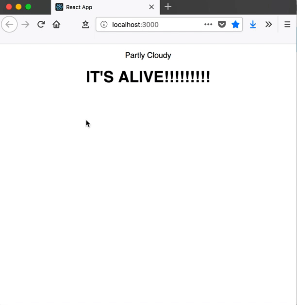

#Reason Weather Fetching

## Data Types

Create type for weather

```js
type weather = {
  summary: string,
  temp: float
};
```

## Stateful Components

Make App.re stateful which requires variants for state and actions.

Create a `state` type which references our `WeatherData` type so when we call `state` it will compile if the weather record is of type `WeatherData`. Note that the `state` type is a `record` which we can tell by the record `{}` syntax. Example: `type state = {weather: WeatherData.weather};`

Create an action type, give it a name and, in this case tell it to expect a record of type WeatherData. So Whenever we call LoadedWeather we have to be sure to pass it a record of type WeatherData.weather. This is not referrign to our state type. When we go to update state, it will check if what we pass it is of the WeatherData type. Here we are not doing that. Just passing the action a type of WeatherData to do something else with. The thing we will be doing, is updating the state.

The `action` type is a `Variant`: a data structure which represents a choice of different values (like enums). Each case in a `Variant` must be capitalised,and can optionally receive parameters.

```js
type action =
  | LoadedWeather(WeatherData.weather);
```

Later we can use the defined `Variants` in a `switch` expression which lets us handle the different options. The options in this case being the built in `Some` and `None` options.

```js
    switch (action) {
    | LoadedWeather(newWeather) => ReasonReact.Update({weather: newWeather})
    },
```

This is one of the most useful features in Reason. Here we're `pattern matching` our defined `actions`, based on the parameter we receive in the reducer() method. The compiler knows that our `switch` statement needs to handle every case of `action`. If we forget to handle a case, the compiler knows, and will tell us! Our current `action` only has one option defined.

Change the component type to `reducerComponent` since we are handling state.

This means we need to override the `initialState`, `reducer`, properties the we spread in with `...component`

## The `make` function

- notes, initial state is a function that returns a record `{}`
- in our reducer, we need to use the record syntax as well.
- the `action` type is a `Variant`: a data structure which represents a choice of different values (like enums). Each case in a `Variant` must be capitalised, and can optionally receive parameters. In

```js
let make = _children => {
  ...component,
  initialState: () => {weather: dummyweather},
  reducer: (action, _prevState) =>
    switch (action) {
    | LoadedWeather(newWeather) => ReasonReact.Update({weather: newWeather})
    },
  render: self =>
    <div className="App">
      <p> (ReasonReact.string(self.state.weather.summary)) </p>
      <p> (ReasonReact.string(string_of_float(self.state.weather.temp))) </p>
    </div>,
};
```

## Excursion: Exhaustive Pattern Matching

Create a scratch file, here `MatchingDemo.re`. Create an `action` type with three options.

```r
type result =
 | Win
 | Lose
 | Draw;
```

Create a function that takes our `result` type and switches based on the `action`. The compiler is inferring that `r` is of the type defined in this file. Given that it's inferring the `result` type, it realizes that one of the options is misssing and tells us by underlying the offending function with squiggly green lines. If you hover over them you get a nice message.

```js
let getPoints = r =>
  switch (r) {
  | Win => 3
  | Lose => 0
  };
```

This is what it looks like in VSCode.


## Fetching Data from an API

Add `@glennsl/bs-json` and `bs-fetch`.

Then add them to your `bsconfig.json` file like this:

```json
  "bs-dependencies": [
    "reason-react",
    "@glennsl/bs-jest",
    "@glennsl/bs-json",
    "bs-fetch"
  ],
```

We'll be using the [Yahoo Weather API](https://developer.yahoo.com/weather/) to fetch our data from our `WeatherData` module, `WeatherData.re`. Our `getWeather()` method will call the API, then parse the result using `parseWeatherResultsJson()`, before resolving with a weather item:

## Parsing the Json Response

First:

```js
let parseWeatherResultsJson = json =>
  Json.parseOrRaise(json)
  |> Json.Decode.(
       at(
         ["query", "results", "channel", "item", "condition"],
         parseWeatherJson,
       )
     );
```

This parses the JSON string response, before traversing the data via the specified fields. It then uses the parseWeatherJson() method to parse the data found inside the condition field with this function which we call in `parseWeatherResultsJson`:

```js
let parseWeatherJson = json : weather =>
  Json.Decode.{
    summary: field("text", string, json),
    temp: float_of_string(field("temp", string, json)),
  };
```

In this snippet, `field` and `string` are properties of `Json.Decode`. This new syntax "opens" `Json.Decode`, so its properties can be used freely within the curly brackets (instead of repeating `Json.Decode` on every field). The code generates a weather item, using the `text` and `temp` fields to assign `summary` and `temp` values.

`float_of_string` does exactly what you'd expect: it converts the temperature from a `string` (as we get from the API) into a `float`.

## Updating State with the [`option variant`](https://reasonml.github.io/docs/en/variant.html#option)

Now we've got a `getWeather()` method which returns a promise, we need to call this when our `App` component loads. ReasonReact has a similar set of lifecycle methods to React.js, with a few small differences. We'll be using the `didMount` lifecycle method for making the API call to fetch the weather.

First of all, we need to change our `state` to show that it's possible to **not** have a weather item in `state` - we'll get rid of the dummy data. `option()` is a built-in `variant` in Reason, which describes a `"nullable"` value:

[`type option('a) = None | Some('a);`](https://reasonml.github.io/docs/en/variant.html#option)

We need to specify `None` in our `state` type and `initial` state, and `Some`(weather) in our `LoadedWeather` reducer:

I've had a hard time retaining how and when to call `None` and `Some` and its the very reason I am writing this post. So I can have a reference and to maybe save someone else some pain.

### `state` using `option`

So, changing our `state` to the built in `option` variant we start with this:

```js
type state = { weather: WeatherData.weather };
```

and end with this:

```js
type state = {
  weather: option(WeatherData.weather)
};
```

By putting `option` before passing in the `WeatherData.weather` type we are telling he compilier that this may or may not return a value. We are saying that this value may be `null` or that its `nullable`. Reason/oCaml doesn't do `null`, the concept doesn't exist because a non-existent value wont type check and Reason is type-safe. That's the point. So the `option` variant lets us do type-safe null values.

### `initialState` using `option`

We start with this:

```js
  initialState: () => {weather: dummyWeather},
```

and get to this:

```js
  initialState: () => {
    weather: None
},
```

Both before and after look basically the same. `initialState` gets `WeatherData` type. In the before version, you can explicity see your `dummyWeather` variable that we had defined. After, that's gone. We now tell `initialState` that it will be set to the `None` option on the `WeatherData` type, whatever that is. So we don't see the explicity defined `record` anymore and that is just the way its supposed to be. We haven't recieved any data back when we just start the app, so `initialState` which is typed as `WeatherData` will have no value. So, we are telling the compiler that `initialState` is of type `WeatherData` but it that it has no value when we start the app.

### `reducer` using `option`

Before:

```js
  reducer: (action, _prevState) =>
    switch (action) {
    | LoadedWeather(newWeather) => ReasonReact.Update({weather: newWeather})
    },
```

After:

```js
reducer: (action, _prevState) => {
    switch action {
    | LoadedWeather(newWeather) =>
      ReasonReact.Update({
        weather: Some(newWeather)
      })
    }
},
```

In before version of our reducer, we passed a new weather record that we get back from the api, here called `newWeather`, to our `reducer` and tell it to update the app.

In the after version, using `option`, we tell it to expect some data, `newWeather` and that is this is the non-null option on our `state` type. So we are passing in data of type `WeatherData` expected by our state `type` and that it should actually have a value.

If the horse is not dead yet, let me know, and I will come back and beat it some more.

Now we can actually make the API request when our component mounts but we need to tell the our `component` how to do that. Looking at the code below, `handleLoadedWeather` is a method which dispatches our `LoadedWeather` `action` we defined at the top of this file, to the `reducer`. When the promise resolves, it will be handled by our `reducer`, and the `state` will be updated! So when `LoadedWeather` gets the data is expecting, the `promise` resolves by sending the data to the `reducer`. The `|>ignore` call tell the compiler to ignore the result of this promise. This is because of the way ocaml is set up. We already handled the response when we called `handleLoadedWeather`.

```js
initialState: () =>...
didMount: (self) => {
    let handleLoadedWeather = weather => self.send(LoadedWeather(weather));

    WeatherData.getWeather()
      |> Js.Promise.then_(
        weather => {
          handleLoadedWeather(weather);
          Js.Promise.resolve();
        }
      )
      |> ignore;
},
```

If we run our app now, the app won't compile. We run into an error... We're currently trying to render information about self.state.weather, but this is set to None until we receive a response from the API. Let's update our App component to show a loading message while we wait:

```js
  render: self =>
    <div className="App">
      <p>
        (
          switch (self.state.weather) {
          | None => ReasonReact.string("Loading weather...")
          | Some(weather) => ReasonReact.string(weather.summary)
          }
        )
      </p>
    </div>,
```

If you run the app now, it will compile and you get this in the browser:



## Error handling with a `switch`

> One thing we haven't thought about is what happens if we can't load our data. What if the API is down, or it returns something we're not expecting? We'll need to recognise this and reject the promise:

```js
let getWeather = () =>
  Js.Promise.(
    Fetch.fetch(url)
    |> then_(Fetch.Response.text)
    |> then_(jsonText =>
         switch (parseWeatherResultsJson(jsonText)) {
         | exception e => reject(e)
         | weather => resolve(weather)
         }
       )
  );
```

> This switch statement tries to parse the API response. If an exception is raised, it will reject the promise with that error. If the parsing was successful, the promise will be resolved with the weather item.

```js
switch (parseWeatherResultsJson(jsonText)) {
 | exception e => reject(e);
 | weather => resolve(weather);
};
```

> Next, we'll change our state to let us recognise if an error has occurred. Let's create a new type which adds an Error case to our previous `Some('a)` or `None`.

```js
type optionOrError('a) =
  | Some('a)
  | None
  | Error;

type state = {
  weather: optionOrError(WeatherData.weather)
};
```
