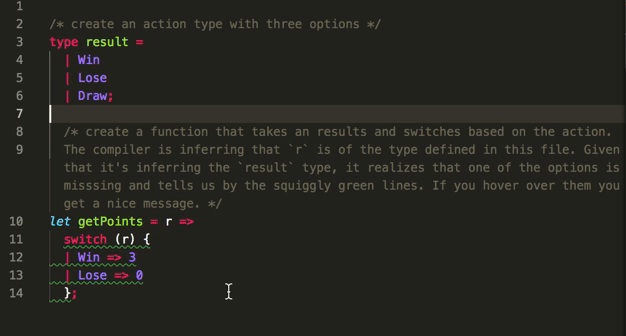

#Reason Weather Fetching

## Data Types

Create type for weather

```js
type weather = {
  summary: string,
  temp: float
};
```

## Stateful Components

Make App.re stateful which requires variants for state and actions.

Create a `state` type which references our `WeatherData` type so when we call `state` it will compile if the weather record is of type `WeatherData`. Note that the `state` type is a `record` which we can tell by the record `{}` syntax. Example: `type state = {weather: WeatherData.weather};`

Create an action type, give it a name and, in this case tell it to expect a record of type WeatherData. So Whenever we call WeatherLoaded we have to be sure to pass it a record of type WeatherData.weather. This is not referrign to our state type. When we go to update state, it will check if what we pass it is of the WeatherData type. Here we are not doing that. Just passing the action a type of WeatherData to do something else with. The thing we will be doing, is updating the state.

The `action` type is a `Variant`: a data structure which represents a choice of different values (like enums). Each case in a `Variant` must be capitalised,and can optionally receive parameters.

```js
type action =
  | WeatherLoaded(WeatherData.weather);
```

Later we can use the defined `Variants` in a `switch` expression which lets us handle the different options. The options in this case being the built in `Some` and `None` options.

```js
    switch (action) {
    | WeatherLoaded(newWeather) => ReasonReact.Update({weather: newWeather})
    },
```

This is one of the most useful features in Reason. Here we're `pattern matching` our defined `actions`, based on the parameter we receive in the reducer() method. The compiler knows that our `switch` statement needs to handle every case of `action`. If we forget to handle a case, the compiler knows, and will tell us! Our current `action` only has one option defined.

Change the component type to `reducerComponent` since we are handling state.

This means we need to override the `initialState`, `reducer`, properties the we spread in with `...component`

## The `make` function

- notes, initial state is a function that returns a record `{}`
- in our reducer, we need to use the record syntax as well.
- the `action` type is a `Variant`: a data structure which represents a choice of different values (like enums). Each case in a `Variant` must be capitalised, and can optionally receive parameters. In

```js
let make = _children => {
  ...component,
  initialState: () => {weather: dummyweather},
  reducer: (action, _prevState) =>
    switch (action) {
    | WeatherLoaded(newWeather) => ReasonReact.Update({weather: newWeather})
    },
  render: self =>
    <div className="App">
      <p> (ReasonReact.string(self.state.weather.summary)) </p>
      <p> (ReasonReact.string(string_of_float(self.state.weather.temp))) </p>
    </div>,
};
```

## Excursion: Exhaustive Pattern Matching

Create a scratch file, here `MatchingDemo.re`. Create an `action` type with three options.

```r
type result =
 | Win
 | Lose
 | Draw;
```

Create a function that takes our `result` type and switches based on the `action`. The compiler is inferring that `r` is of the type defined in this file. Given that it's inferring the `result` type, it realizes that one of the options is misssing and tells us by underlying the offending function with squiggly green lines. If you hover over them you get a nice message.

```js
let getPoints = r =>
  switch (r) {
  | Win => 3
  | Lose => 0
  };
```

This is what it looks like in VSCode.



## Fetching Data from an API

Add `@glennsl/bs-json` and `bs-fetch`.

Then add them to your `bsconfig.json` file like this:

```json
  "bs-dependencies": [
    "reason-react",
    "@glennsl/bs-jest",
    "@glennsl/bs-json",
    "bs-fetch"
  ],
```
