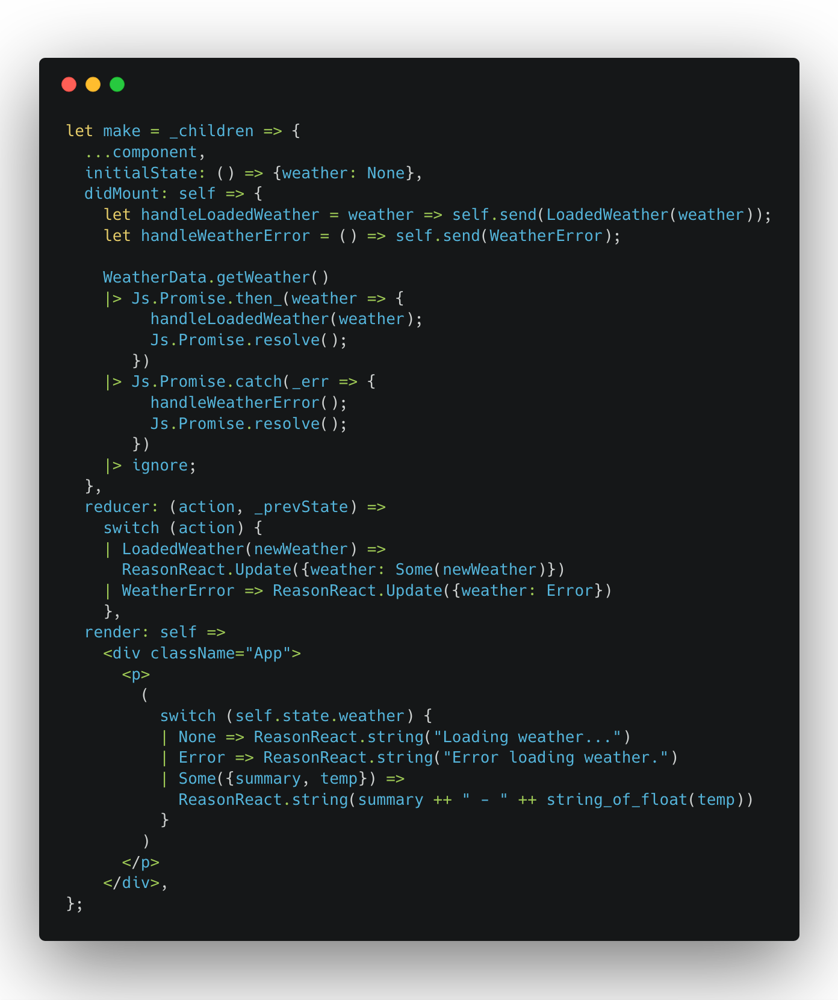
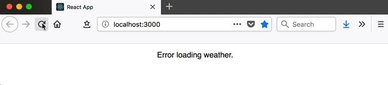

# Get Reason-able with a ReasonReact Weather Fetching App

In this tutorial, we're going to build a small weather app using [Reason](https://reasonml.github.io/en/) and [ReasonReact](https://reasonml.github.io/reason-react/). There's a link to the source code at the bottom of the page. This tutorial assumes a basic understanding of React, as we'll be using the ReasonReact bindings to build the app. If you haven't used React before, this [article](https://dev.to/tylermcginnis/a-comprehensive-guide-to-reactjs-in-2018--4nbc) is a great place to start.

## Types in Reason

Let's create a new file, `WeatherData.re`. This will define the data structure and any related methods for our Weather `record`. To begin with, let's create the type for `weather`:

    

Within this file, we can create new records using this data structure, and the compiler will know that it's a `Weather` item. From other files, we'll need to tell the compiler what the type is. In Reason, files can be referenced as modules, meaning we don't have to explicitly import them! We can just do this:

    

I mentioned earlier that Reason has 100% type coverage, but we've only defined our Weather type... where does the rest of the coverage come from? We could explicitly define a type for every variable we use, e.g. let greeting: string = "Hello"; but fortunately the OCaml system can infer types for us. So if we write let greeting = "Hello"; the compiler will still know that greeting is a string. This is a key concept in Reason and guarantees type safety.

## Stateful Components

Moving back to our project, let's modify `App.re` so it can store the data we want to display. This will involve the following steps:

    1. Defining the type of our state
    2. Setting our initial state (with some dummy data, for now)
    3. Defining actions that can be applied to state
    4. Defining reducers for the component to handle these

`Actions` define the different things we can do to manipulate `state`. For example, `Add` or `Subtract`. Reducers are pure functions which define how state should be affected by these actions, just like in Redux. They take the action and our previous state as parameters, and return an [update type](https://reasonml.github.io/reason-react/docs/en/state-actions-reducer.html#state-update-through-reducer).

Make `App.re` stateful which requires variants for state and actions.

Create a `state` type which references our `WeatherData` type so when we call `state` it will compile if the weather record is of type `WeatherData`. Note that the `state` type is a `record` which we can tell by the record `{}` syntax. Example: `type state = {weather: WeatherData.weather};`

Create an `action` type, give it a name and, in this case tell it to expect a record of type `WeatherData`. So whenever we call `LoadedWeather` we have to be sure to pass it a record of type `WeatherData.weather`. This is not referring to our `state` type. When we go to update `state`, the compiler will check if what we pass `LoadedWeather` is of the `WeatherData` type. Here we are not doing that. We are just passing the `action` a type of `WeatherData` to do something else with. The thing we will be doing, is updating the `state`.

The `action` type is a `Variant`: a data structure which represents a choice of different values (like enums). Each case in a `Variant` must be capitalised,and can optionally receive parameters.

Later we can use the defined `Variants` in a `switch` expression which lets us handle the different options. The options in this case being the built in `Some` and `None` options.

This is one of the most useful features in Reason. Here we're `pattern matching` our defined `actions`, based on the parameter we receive in the `reducer()` method. The compiler knows that our `switch` statement needs to handle every case of `action`. If we forget to handle a case, the compiler knows, and will tell us! Our current `action` only has one `option` defined.

To use `state` in this component we need to change the component type to `reducerComponent`.

This means we need to override the `initialState`, `reducer`, properties the we spread in with `...component`. What? When we create a ReasonReact component, it comes with [`props`](https://reactjs.org/docs/components-and-props.html). Check the link if you have no idea what I'm talking about.

## The `make` function

`initial state` is a function that returns a record `{}`
In our `reducer`, remember to use the record syntax as well.
The `action` type is a `Variant`: a data structure which represents a choice of different values (like enums). Each case in a `Variant` must be capitalised, and can optionally receive parameters.

## Excursion: Exhaustive Pattern Matching

Create a scratch file, here `MatchingDemo.re`. Create an `action` type with three options.

    

Create a function that takes our `result` type and switches based on the `action`. The compiler is inferring that `r` is of the type defined in this file. Given that it's inferring the `result` type, it realizes that one of the options is misssing and tells us by underlying the offending function with squiggly green lines. If you hover over them you get a nice message.

    

This is what it looks like in VSCode.

    

## Fetching Data from an API

Add `@glennsl/bs-json` and `bs-fetch`.

Then add them to your `bsconfig.json` file like this:

    

We'll be using the [Yahoo Weather API](https://developer.yahoo.com/weather/) to fetch our data from our `WeatherData` module, `WeatherData.re`. Our `getWeather()` method will call the API, then parse the result using `parseWeatherResultsJson()`, before resolving with a weather item:

## Parsing the Json Response

First:

This parses the JSON string response, before traversing the data via the specified fields. It then uses the parseWeatherJson() method to parse the data found inside the condition field with this function which we call in `parseWeatherResultsJson`:

In this snippet, `field` and `string` are properties of `Json.Decode`. This new syntax "opens" `Json.Decode`, so its properties can be used freely within the curly brackets (instead of repeating `Json.Decode` on every field). The code generates a weather item, using the `text` and `temp` fields to assign `summary` and `temp` values.

`float_of_string` does exactly what you'd expect: it converts the temperature from a `string` (as we get from the API) into a `float`.

## Updating State with the [`option variant`](https://reasonml.github.io/docs/en/variant.html#option)

Now we've got a `getWeather()` method which returns a promise, we need to call this when our `App` component loads. ReasonReact has a similar set of lifecycle methods to React.js, with a few small differences. We'll be using the `didMount` lifecycle method for making the API call to fetch the weather.

First of all, we need to change our `state` to show that it's possible to **not** have a weather item in `state` - we'll get rid of the dummy data. `option()` is a built-in `variant` in Reason, which describes a `"nullable"` value:

    

We need to specify `None` in our `state` type and `initial` state, and `Some`(weather) in our `LoadedWeather` reducer:

I've had a hard time retaining how and when to call `None` and `Some` and its the very reason I am writing this post. So I can have a reference and to maybe save someone else some pain.

### `state` using `option`

So, changing our `state` to the built in `option` variant we start with this:

    

and end with this:

    

By putting `option` before passing in the `WeatherData.weather` type we are telling he compilier that this may or may not return a value. We are saying that this value may be `null` or that its `nullable`. Reason/oCaml doesn't do `null`, the concept doesn't exist because a non-existent value wont type check and Reason is type-safe. That's the point. So the `option` variant lets us do type-safe null values.

### `initialState` using `option`

We start with this:

    

and get to this:

    

Both before and after look basically the same. `initialState` gets `WeatherData` type. In the before version, you can explicity see your `dummyWeather` variable that we had defined. After, that's gone. We now tell `initialState` that it will be set to the `None` option on the `WeatherData` type, whatever that is. So we don't see the explicity defined `record` anymore and that is just the way its supposed to be. We haven't recieved any data back when we just start the app, so `initialState` which is typed as `WeatherData` will have no value. So, we are telling the compiler that `initialState` is of type `WeatherData` but it that it has no value when we start the app.

### `reducer` using `option`

Before:

    

 
After:

    

In before version of our `reducer`, we passed a new weather `record` that we get back from the api, here called `newWeather`, to our `reducer` and tell it to update the app.

In the after version, using `option`, we tell it to expect some data, `newWeather` and that is this is the non-null `option` on our `state` type. So we are passing in data of type `WeatherData` expected by our state `type` and that it should actually have a value.

If the horse is not dead yet, let me know, and I will come back and beat it some more.

Now we can actually make the API request when our component mounts but we need to tell the our `component` how to do that. Looking at the code below, `handleLoadedWeather` is a method which dispatches our `LoadedWeather` `action` we defined at the top of this file, to the `reducer`. When the promise resolves, it will be handled by our `reducer`, and the `state` will be updated! So when `LoadedWeather` gets the data is expecting, the `promise` resolves by sending the data to the `reducer`. The `|>ignore` call tell the compiler to ignore the result of this promise. This is because of the way ocaml is set up. We already handled the response when we called `handleLoadedWeather`.

If we run our app now, the app won't compile. We run into an error... We're currently trying to render information about self.state.weather, but this is set to None until we receive a response from the API. Let's update our App component to show a loading message while we wait:

If you run the app now, it will compile and you get this in the browser:

    

## Error handling with a `switch`

> One thing we haven't thought about is what happens if we can't load our data. What if the API is down, or it returns something we're not expecting? We'll need to recognise this and reject the promise:

> This switch statement tries to parse the API response. If an exception is raised, it will reject the promise with that error. If the parsing was successful, the promise will be resolved with the weather item.

Next, we'll change our state to let us recognise if an error has occurred. Let's create a new type which adds an Error case to our previous `Some('a)` or `None` which means the horse is not dead and must be beat. Where did that `Some('a)` or `None` come from? Its from the built in `option` type. Again,

    
    <caption><a href="https://reasonml.github.io/docs/en/variant.html#option)"/>https://reasonml.github.io/docs/en/variant.html#option</caption>

 

`('a)` is the type signature for any type. It's the type we are passing when we use `option`. So when we are using the `optionOrError` type, we are telling the compiler to look for `Some` option of type `('a)`

After setting this up, we'll also need to add a function to `Error` case to our render function,
`let handleWeatherError = () => self.send(WeatherError);`
Finally, we need to create a new `action` and `reducer` to be used when our `getWeather()` promise rejects.

    

This is what the `make` function looks like after we do the above. Just for fun, i've used some destructuring to pull out the `summary` and `temp` values from the data passed into our `switch` statement. Note that we had to use `string_of_float` to get the `temp` value, which is of type `float` to convert to a `string` so that ReasonReact could render it to the browswer.

To test our error message, I have passed used this query which looks the city `newyork` in `france` which obviously will not work.

    

  
 
And in the browser, working error handling!  

    

These are concepts we've used already, but it's useful to let the user know if something goes wrong. We don't want to leave them hanging with a "loading" message!

There we have it, our first ReasonReact web app. Nice work! We've covered a lot of new concepts, but hopefully you can already see some of the benefits of using Reason.

If you found this interesting & would like to see another post building upon this, please let me know by clicking a reaction below! ❤️ 🦄 🔖

## Further Reading

The [source code](https://github.com/idkjs/reason-weather-fetch-demo).

[Exploring ReasonML and functional programming](http://reasonmlhub.com/exploring-reasonml/) - a free online book about (you guessed it) Reason and FP.

## Related OSS projects to checkout:

[bs-jest](https://github.com/glennsl/bs-jest) - BuckleScript bindings for Jest.  
[lwt-node](https://github.com/kennetpostigo/lwt-node) - a Reason implementation of the Node.js API  
[reason-apollo](https://github.com/apollographql/reason-apollo) - bindings for Apollo client and React Apollo

## Other related good links:

[Discord channel](https://discordapp.com/invite/reasonml) - The legendarily nice Reason Discord Live Help  
[Reasonml.chat](https://reasonml.chat/) - The Reason Chat Forum  
[Reason Town](https://reason.town/) - A podcast on the ReasonML language and community  
[Redex](https://redex.github.io/) - The Reason package index  
[ReasonML](http://reasonml.github.io/) - The Reason homepage  
[ReasonReact](https://reasonml.github.io/reason-react/) - The ReasonReact homepage

## Thank You

Post structure and content substantially inspired by [@jlewin](https://twitter.com/jlewin_)'s [Getting Started](https://dev.to/jlewin_/reasonml-getting-started-53gi) tutorial.

<h3>
<a href="https://carbon.now.sh/">carbon.now.sh</a>  for code screenshots.
</h3>
